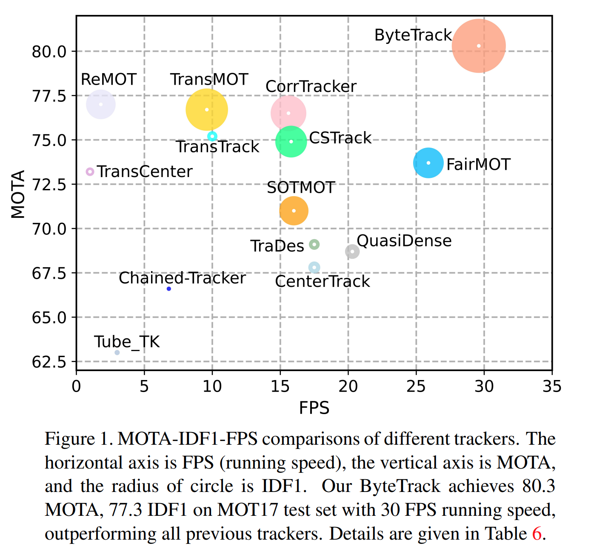
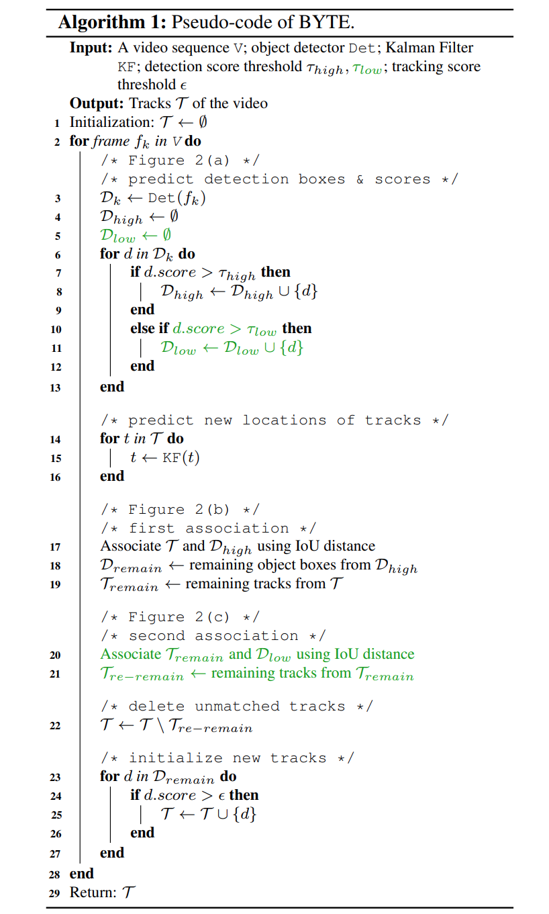
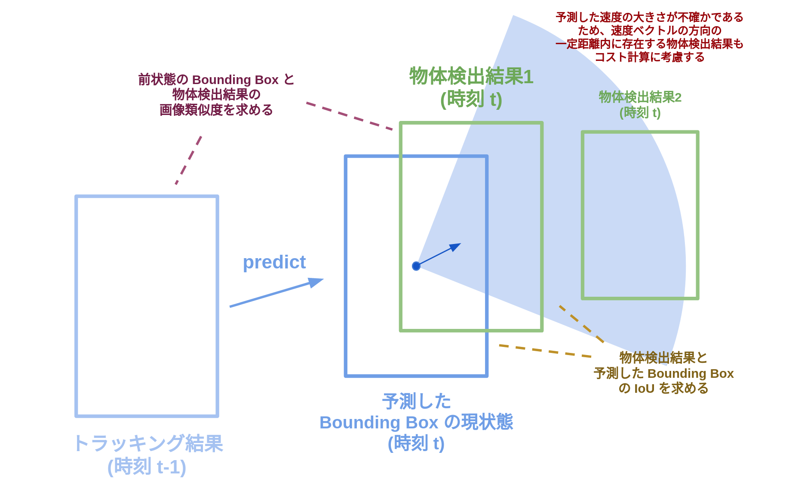

<link rel="stylesheet" href="https://cdn.jsdelivr.net/npm/katex@0.10.0/dist/katex.min.css" integrity="sha384-9eLZqc9ds8eNjO3TmqPeYcDj8n+Qfa4nuSiGYa6DjLNcv9BtN69ZIulL9+8CqC9Y" crossorigin="anonymous">
<script defer src="https://cdn.jsdelivr.net/npm/katex@0.10.0/dist/katex.min.js" integrity="sha384-K3vbOmF2BtaVai+Qk37uypf7VrgBubhQreNQe9aGsz9lB63dIFiQVlJbr92dw2Lx" crossorigin="anonymous"></script>
<script defer src="https://cdn.jsdelivr.net/npm/katex@0.10.0/dist/contrib/auto-render.min.js" integrity="sha384-kmZOZB5ObwgQnS/DuDg6TScgOiWWBiVt0plIRkZCmE6rDZGrEOQeHM5PcHi+nyqe" crossorigin="anonymous"></script>
<script>
 document.addEventListener("DOMContentLoaded", () => {
   renderMathInElement(document.body, {
     delimiters: [
       { left: "$$", right: "$$", display: true },
       { left: "$", right: "$", display: false }
     ]
   });
 });
</script>

# 第5回 AIエッジコンテスト Vertical-Beach レポート

## 最終成果物概要
- 対象ボード: Ultra96v2
- 物体検出アルゴリズム: YOLOv4-tiny
- トラッキングアルゴリズム: ByteTrack
- HW構成: Xilinx DPU + RISCV
- DPU動作周波数: 150/300MHz
- RISCVアーキテクチャ: rv32imfac
- RISCV動作周波数: 150MHz
- RISCV独自追加命令: なし
- RISCVで実行される処理: 線形割当問題のハンガリアン法アルゴリズム
- 使用開発環境: Vivado/Vitis/Petalinux 2020.2, Vitis-AI v1.4, VexRiscv
- 最終成果物の公開予定リポジトリ: https://github.com/Vertical-Beach/ai-edge-contest-5
- 最終評価値: 0.2807344
- 最終評価結果可視化動画（限定公開）: https://youtu.be/xeXifLHZIno

## 最終成果物処理性能
|          |per frame[ms]|per test video[ms]|
|----------|------------:|-----------------:|
|物体検出  |        51.66|              7748|
|物体追跡  |        29.93|              4489|
|全体処理  |        52.30|              7845|

- 後述の通り、マルチスレッド化により`全体処理時間 < 物体検出時間 + 物体追跡時間`となる。
- `全体処理時間`はメモリに動画のフレーム画像を読み込んでから、評価用のJSONファイルと等価な情報が生成されるまでの時間を指す。

## 開発方針
第4回までのAIエッジコンテストとは異なり、今回のコンテストではRISCVの使用が提出要件となることから、コンテスト開始当初から提出のハードルが高いことが明らかであった。
トラッキング処理の代表的な手法は物体検出と追跡処理を分けて行う`Tracking-by-Detection`方式と、それらを同時に行う`Joint detection and tracking`方式に分類される。これまでのコンテストでXilinx DPUを使った物体検出の実装の経験があること、RISCVでのDNNモデルの推論処理の実装の難しさなどの理由から、`Tracking-by-Detection`方式によるトラッキング処理を選択した。また、物体検出とトラッキング処理を分けて進めることで、チームメンバー2名で分担する作業の依存が少なくなった。

## HW構成

### RISCVコア
コンテストの要件であるRISCVコアの実装には、コンテスト側から提供されるリファレンス環境をベースにした。
リファレンス環境で提供されるRISCVコアは、RISCVコアの実装として[VexRiscv](https://github.com/SpinalHDL/VexRiscv)を採用している。リファレンスで提供されるコアのアーキテクチャは`rv32im`であり、浮動小数点演算命令に対応していなかった。

VexRiscvではプラグインを有効化することで様々なアーキテクチャのコアを生成することができる。`FPUPlugin`を有効化するなどのプラグインの追加を行うことで`rv32imfac`アーキテクチャのRISCVコアを生成した。リファレンス環境で提供されるRISCVコアは、RISCVコアの命令バスおよびデータバスをAXIプロトコルで接続する為に独自に実装されたVerilog HDLモジュール(`axi4lite_stream_if.v`)を使用していたが、FPUの追加に伴い、このモジュールを使用できなくなった。（FPUを使用するには命令バスとデータバスのプラグインにキャッシュ対応のものを使用する必要がありポート数が変更されるため。）独自モジュールを使用する変わりにVexRiscvの機能を用いて命令バス・データバスをAXIプロトコル化した。

RISCVコアのクロックは150Mhzの`pl_clk1`を与えて合成を行なったところ、タイミングに問題はなかった。
以下にRISCVコアを搭載したFPGAブロックデザインおよびリソース使用率を示す。後述するXilinx DPUはこの時点では搭載されていない。リファレンス環境同様、RISCVコアの命令メモリ`IMEM`、データメモリ`DMEM`がBlockRAMとして作成し、AXIプロトコルで接続されている。これにより、ARM PSコアおよびRISCVコアの両方からIMEMとDMEMにアクセスすることができる。リファレンス環境から`IMEM`のデータサイズを64K、`DMEM`のデータサイズを128Kに拡張した。
なお、リファレンス環境ではRISCVコアのリセットを`AXI GPIO`経由で駆動していたが、RISCVコアのリセット時にAXIバスのリセットが駆動されず、2度目のリセット以降RISCVコアが正しく動作しない問題があった。このため設計したブロックデザインではRISCVコアおよびAXIバスのリセットをPSコアの`pl_resetn1`に接続している。


### Xilinx DPU
物体検出推論処理にはXilinx DPUを使用した。DPUはXilinxから提供されているIPコアであり、[Vitis-AI](https://japan.xilinx.com/products/design-tools/vitis/vitis-ai.html)を用いてDNNモデルをDPU向けのモデルに変換し、`VART(Vitis-AI Runtime)`を用いてARMコアからDPUを制御することができる。Vitis-AIを使用することで、少ない工数でDNNモデルの推論処理をFPGAにオフロードすることが可能である。DPUは処理性能とリソース使用率の異なるいくつかのコンフィグレーションを選択することができる。RISCVコアとDPUコアの両方を搭載する必要があるため、比較的リソース使用率の低いB1600を使用した。

### RISCV+DPUデザインの作成
Xilinx DPUを搭載するブロックデザインの生成には一般的にVitisフローを使用する。
VitisフローではベースとなるVivadoプラットフォームデザインを選択し、その上でFPGAにオフロードしたい処理を「カーネル」として作成する。Vitisでの全体のシステムビルド時に、カーネルがベースのブロックデザインに自動的に追加され適宜クロック・リセット・データバスの配線が行われる。

上に示したRISCVコアおよびデータ・命令メモリの構成はVitisで自動的に行うことができない。そこで上に示したブロックデザインをVitisのベースデザインとし、その上でVitis上でDPUコアを追加するようにした。DPUに与える周波数は150/300Mhzとした。（DPUにはベースとなるクロックと、その2倍のクロックの2つを与える。）下にVitisにより自動生成された、RISCV+DPUのブロックデザインおよびリソース使用率を示す。

また、ARMコアで動作させるPetalinuxシステムも、Vitisフローにおいて自動的にビルドされる。


## 物体検出処理
物体検出処理のDNNモデルとして[tiny-YOLOv4](https://github.com/AlexeyAB)を採用した。採用した理由としては比較的軽量なモデルであること、第2回AIエッジコンテストで多数の参加者が使用していたtiny-YOLOv3にくらべて推論精度が向上していることが挙げられる。コンテストの題材が同じ第3回AIエッジコンテストでは、入賞者は精度向上のために入力画像の解像度を元動画とほぼ解像度としていたが、今回はエッジデバイスでの高速な推論を実現する必要があったため、入力解像度は416*416とした。

tiny-YOLOv4の学習はオリジナルのリポジトリを参考に行なった。コンテストで与えられている学習画像は少ないため、同じ交通データセットである[BDD100K](https://bair.berkeley.edu/blog/2018/05/30/bdd/)を使用して最初の学習を行い、途中からSIGNATEのデータセットを使用して学習を行なった。学習過程でのlossおよびmAPカーブを以下に示す。400000iterationを超えたところで学習は打ち切った。学習中のmAPが最大になったのは150000iterationを過ぎたあたりで、mAPの値は47.1であった。なお、tiny-YOLOv3も同様に学習を行なったが、mAPのベストスコアは36.0でありtiny-YOLOv4のほうが精度が高いことが確認された。


Vitis-AIでDPU向けにtiny-YOLOv4を変換するにあたり、以下の工夫を行なった。オリジナルのtiny-YOLOv4はdarknetフレームワークを用いているが、Vitis-AIのDPU向けの変換可能な入力フレームワークはTensorflow, Caffe, PyTorchでありdarknetには直接対応していない。Vitis-AIでは[darknetのモデルをCaffeのフレームワークに変換するためのスクリプト](https://github.com/Xilinx/Vitis-AI/blob/1.4/models/AI-Model-Zoo/caffe-xilinx/scripts/convert.py)が公開されている。ただし、このスクリプトをそのまま使用するとtiny-YOLOv4の中間層に含まれるgroupレイヤがDPUで処理できないために、DPUで実行されるモデルが分割されてしまう。モデルが分割されると、groupレイヤの処理はARMコアで実行されるため、ARMコアとDPUコアでの通信が推論処理の前後だけでなく間でも必要になり推論時間が増加してしまう。この問題を解決するために、groupレイヤを演算が等価なconvolutionレイヤに置き換えるように変換スクリプトを修正した。修正した結果、tiny-YOLOv4の推論処理はすべてDPU上で実行されるようになった。

## トラッキング処理

トラッキング処理では物体検出処理で得られた物体のフレーム間の紐付けを行う。  
具体的には同一の物体に対して同一の ID を付与する。

我々のチームではトラッキングアルゴリズムに [[Y. Zhang+, arXiv21] `ByteTrack`](https://arxiv.org/abs/2110.06864) を採用した。  
ByteTrack は物体検出結果のスコアを使用して物体のフレーム間の紐付けを段階的に行う。  
スコアの高い検出結果とスコアの低い検出結果を別々に扱うことで、シンプルなアルゴリズムでありつつも既存の手法と比べて高い精度を達成している。

| MOT アルゴリズム比較 | ByteTrack の擬似コード |
| ---- | ---- |
|  |  |  
([Y. Zhang+, arXiv21] Figure.1 および Algorithm.1 より引用)

ByteTrack を採用した理由として以下が挙げられる。

- Tracking-by-Detection 系のトラッキングアルゴリズムであり、 DPU を用いた物体検出処理との統合が容易であるため
  - [オリジナルの ByteTrack](https://github.com/ifzhang/ByteTrack) は物体検出に YOLOX を利用している
  - 2D Bounding Box とそのスコア (confidence) を出力する物体検出アルゴリズムであれば他のアルゴリズムでも利用可能
- 処理が比較的高速であり、かつ、それなりの精度が見込まれたため
  - 処理はカルマンフィルタによる予測／更新、 IoU 計算、ハンガリアン法によるマッチング処理等で構成されている
- DNN ベースの手法とは異なり、使用するパラメータ数が少ないことから FPGA 上の RISC-V コアへのオフロードが容易と思われたため

ByteTrack の公開実装には Python 実装および C++ 実装が含まれる。  
この内 C++ 実装を切り出し、物体検出アルゴリズムへの依存を排除した上でリファクタリングを行った。  
リファクタリング後の実装は [こちら](https://github.com/Vertical-Beach/ByteTrack-cpp) で公開している。

### トラッキング処理の精度改善

DPU による tiny-YOLOv4 の推論結果をオリジナルの ByteTrack に入力して評価を行ったところ MOTA の値が 0.177 となった。  
十分なトラッキング精度が得られない原因として以下が挙げられる。

- 評価対象の動画のフレームレートが低く、特に車両走行時の歩行者の状態をカルマンフィルタによって予測するのが困難

ByteTrack の preprint において評価対象となっているのは [MOT Challenge](https://motchallenge.net/) のデータセットであり、このデータセットに含まれる 30 FPS の動画が使用されていた。  
今回のコンテストのテストデータは 5 FPS であるため、この差を考慮して精度改善を行う必要があった。

精度改善にあたり、オリジナルの ByteTrack の実装に対して主に以下の変更を加えた。

1. パラメータ調節
2. コスト計算時に画像類似度および距離を考慮する実装を追加

これらの変更によってテストデータでの MOTA の値が 0.177 から **0.280** まで向上した。  

#### 1. パラメータ調節

以下の既存のパラメータを tiny-YOLOv4 および今回のテストデータ向けに調節した。

- 物体検出アルゴリズムのスコアに関するしきい値
- カルマンフィルタのシステム雑音と観測雑音に対する重み
- ロストした物体の生存期間

#### 2. コスト計算時に画像類似度および距離を考慮する実装を追加

オリジナルの ByteTrack の実装は以下の2つの Bounding Box 間の IoU を計算し、この値をコストとしてハンガリアン法による線形割当問題を解く。

- カルマンフィルタによって予測した Bouding Box の現状態
- 物体検出アルゴリズムの推論結果

カルマンフィルタは Bouding Box の状態に対する予測を行う。  
この状態は $\{x_c, y_c, a, h, vx_c, vy_c, va, vh\}$ の8変数で表され、それぞれ、

- $x_c$: Bounding Box の中心の x 座標
- $y_c$: Bounding Box の中心の y 座標
- $a$: Bounding Box のアスペクト比
- $h$: Bounding Box の高さ
- $vx_c$: $x_c$ の速度
- $vy_c$: $y_c$ の速度
- $va$: $a$ の速度
- $vh$: $h$ の速度

を表す。  
この状態空間モデルのシステム行列 $A$ と観測行列 $C$ はそれぞれ以下のように定義されている。

$$
A = \begin{bmatrix}
  1 & 0 & 0 & 0 & 1 & 0 & 0 & 0 \cr
  0 & 1 & 0 & 0 & 0 & 1 & 0 & 0 \cr
  0 & 0 & 1 & 0 & 0 & 0 & 1 & 0 \cr
  0 & 0 & 0 & 1 & 0 & 0 & 0 & 1 \cr
  0 & 0 & 0 & 0 & 1 & 0 & 0 & 0 \cr
  0 & 0 & 0 & 0 & 0 & 1 & 0 & 0 \cr
  0 & 0 & 0 & 0 & 0 & 0 & 1 & 0 \cr
  0 & 0 & 0 & 0 & 0 & 0 & 0 & 1
\end{bmatrix}, \quad C = \begin{bmatrix}
  1 & 0 & 0 & 0 & 0 & 0 & 0 & 0 \cr
  0 & 1 & 0 & 0 & 0 & 0 & 0 & 0 \cr
  0 & 0 & 1 & 0 & 0 & 0 & 0 & 0 \cr
  0 & 0 & 0 & 1 & 0 & 0 & 0 & 0
\end{bmatrix}
$$

すなわち、Bounding Box の予測においては前状態に対して速度を足した結果を現状態の予測値としている。  
フレームレートが低い今回のテストデータに対してこの予測を実施すると以下の問題が発生する。

- 特に初期化直後において、速度の分布の平均の絶対値が小さい状態であっても物体の座標が大きく動くことがある
- 加速度まで考慮していないため、車両が高速で移動しているときに予測結果がずれる

これらの問題によってハンガリアン法による物体の紐付けの精度が低下していることが分かった。  
精度の低下を緩和するために、カルマンフィルタによる予測値と物体検出結果の IoU の値以外に以下の2つをコストに考慮させるようにした。

1. 予測した Bounding Box と物体検出結果の距離
1. 前状態の Bounding Box と物体検出結果の画像類似度

図にすると以下のようになる。



速度の予測値が実際の値より小さい場合が多いため、速度ベクトルの向きの $\pm \pi / 4$ の一定距離内に存在する物体検出結果をコスト計算に考慮している。  
具体的には、距離が近い順にコストを下げるようにしている。

画像類似度の計算には以下の指標を利用している。

- 色相 (Saturation)
- 彩度 (Hue)
- Local Binary Pattern (LBP) 特徴量

色相および彩度は HSV 変換により求めており、色の特徴を得るために利用している。  
LBP 特徴量はテクスチャの特徴を得るために利用している。

それぞれヒストグラム化して固定長のベクトルとし、これを特徴量として扱った。  
また、 Bounding Box をブロック分割してそれぞれのブロックの特徴量を連結させることで空間情報も考慮させている。  
車両は縦方向に3分割し、歩行者は縦方向に2分割した。

上記の画像特徴量を

- 前状態の Bounding Box
- 物体検出結果

のそれぞれに対して導出し、各特徴量のコサイン類似度を計算、その重み付け平均をコストに反映した。  
ただし、前状態の Bounding Box と物体検出結果の距離が大きい場合にはこれを考慮しないようにしている。

## RISCVへの処理のオフロード
トラッキング処理に含まれる`lapjv(Linear Assignment Problem solver using Jonker-Volgenant algorithm)`関数をRISCV上で実行することにした。
<!-- この処理はなんかハンガリアン法でいい感じにいい感じのマッチングをするやつです -->
RISCV上で実行する処理に`lapjv`関数を選択したのは、元のByteTrackの実装がSTLを使用しておらず、RISCVにオフロードしやすそうであったこと、乗算や除算が含まれておらずRISCVコアでの処理もある程度の速度が見込めることが理由として挙げられる。

RISCVコアへの処理のオフロードは以下の手順で行なった。
まず、元の実装からオフロードする処理を切り出してRISCV向けのクロスコンパイラを使用してコンパイルする。クロスコンパイラには[cross-NG](https://crosstool-ng.github.io/)を使用した。`cross-NG`ではRISCVを含めた様々なアーキテクチャのCPU向けのクロスコンパイラを生成することができる。
次にRISCVコア向けに命令メモリ`IMEM`にセットすべき命令列を作成する。RISCVのスタートアップ処理やリンクに必要なファイルはリファレンス環境のものを参考にした。

RISCVコアへオフロードした処理のARMコアからの実行手順は以下のようになる：
1. `IMEM`に命令列をセット
2. `DMEM`にRISCV向けの入力データをセット
3. `pl_resetn1`をリセット・RISCVでの処理が実行開始される
4. RISCVの処理完了を待機
5. `DMEM`にあるRISCVの処理結果を取得

2.および5.では入出力に使用する`DMEM`のアドレスをプログラム内で固定することでARMコアとRISCVコアでの入出力を簡単に行なっている。
説明のために、Vivadoで設定した`DMEM Controller`の使用するアドレス空間を以下に示す。

画像に示すとおり、`DMEM Controller`は`0xA002_0000~0xA003_FFFF`に割り当てられている。この128Kのデータ領域のうち前半`0xA002_0000~0xA002_FFFF`をRISCVのプログラム実行時使用領域、後半`0xA003_0000~0xA003_FFFF`を入出力のデータ配置領域とした。命令列作成時のリンカスクリプトには`DMEM`の領域を半分の64を指定することで後半の領域を使用されないようにした。
```c
MEMORY {
  ROM (rx) : ORIGIN = 0xA0000000, LENGTH = 64K  /*start from 0xA0000000 to 0xA000FFFF*/
  RAM (wx) : ORIGIN = 0xA0020000, LENGTH = 64K  /*start from 0xA0020000 to 0xA0002FFF*/
}
```


下記にARMコアで実行されるコード、およびRISCV向けにコンパイルされるコードの一部を示す。`0xA0030000`をオフセットとして入出力のデータにアクセスしていることがわかる。

- ARMコアでのRISCVの実行コード
```cpp
#define DMEM_OFFSET 1024*16 //64K offset
// /dev/uio0 is AXI DMEM BRAM Controller
int uio0_fd = open("/dev/uio0", O_RDWR | O_SYNC);
volatile int* DMEM_BASE = (int*) mmap(NULL, 0x20000, PROT_READ|PROT_WRITE, MAP_SHARED, uio0_fd, 0);

//set input
DMEM_BASE[DMEM_OFFSET+0] = n;
volatile float* DMEM_BASE_FLOAT = (volatile float*) DMEM_BASE;
for(int i = 0; i < n; i++){
    for(int j = 0; j < n; j++){
        DMEM_BASE_FLOAT[DMEM_OFFSET+i*n+j+1] = cost[i][j];
    }
}
//set incomplete flag
DMEM_BASE[DMEM_OFFSET+(1+n*n+n*2)] = 0;
//start RISCV
reset_pl_resetn0();
//wait completion
while(1){
    bool endflag = DMEM_BASE[DMEM_OFFSET+(1+n*n+n*2)] == n*2;
    if(endflag) break;
    usleep(1);
}
//get output
volatile int* riscv_x = &DMEM_BASE[DMEM_OFFSET+1+n*n];
volatile int* riscv_y = &DMEM_BASE[DMEM_OFFSET+1+n*n+n];
```

- RISCV向けにコンパイルされるコード
```cpp
#define DMEM_BASE  (0xA0030000)
#define REGINT(address) *(volatile int*)(address)
#define REGINTPOINT(address) (volatile int*)(address)
#define REGFLOAT(address) *(volatile float*)(address)
int main(){
    int n = REGINT(DMEM_BASE);
    //start flag
    REGINT(DMEM_BASE+4*(1+n*n+n*2)) = n;

    volatile float cost[N_MAX*N_MAX];
    for(int i = 0; i < n*n; i++) cost[i] = REGFLOAT(DMEM_BASE+4*(1+i));
    volatile int* x = REGINTPOINT(DMEM_BASE+4*(1+n*n));
	volatile int* y = REGINTPOINT(DMEM_BASE+4*(1+n*n+n));
    int ret = lapjv_internal(n, cost, x, y);

    //end flag
    REGINT(DMEM_BASE+4*(1+n*n+n*2)) = n*2;
    while(1){
    }
    return 1;
}
```

また、4.のRISCVの処理完了待機の実現には割り込みよりも簡単なポーリング方式を使用した。特定のアドレス（上記コードでは`DMEM_BASE[DMEM_OFFSET+(1+n*n+n*2)]`）が完了を示す値になるまでARM側で待機している。

## マルチスレッド化
評価用アプリケーションでは、入力動画の各フレーム画像に対して物体検出処理およびトラッキング処理を順に実行する。物体検出処理ではFPGA上のDPUコアの実行完了待ちが処理時間の大半を占めており、ARMコアが使用されていない時間が長い。我々はこれらの処理のマルチスレッド実装を行なった。トラッキング処理実行中に次フレームの物体検出を実行することで、シーケンシャルに処理する場合に比べて大幅な高速化が見込まれる。

以下にマルチスレッド化前後での1フレームの画像に対する処理性能を示す。

|          | multithread[ms]| sequential[ms]|
|--------- | -------------: | ------------: |
|物体検出  |           51.66|           49.05|
|物体追跡  |           29.93|           27.93|
|全体処理  |           52.30|           77.08|

マルチスレッド化により、全体処理が77.08/52.30=**1.47**倍高速になった。
物体検出とトラッキング処理のそれぞれの時間がマルチスレッド化によって遅くなっているのはCPUの負荷がシーケンシャル実行時よりも大きいからであると考えられる。
