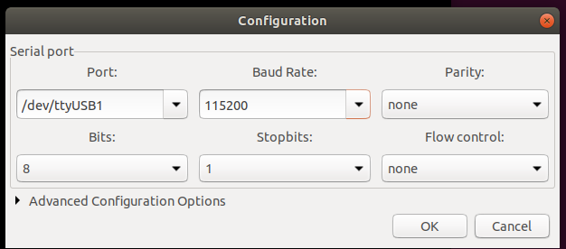
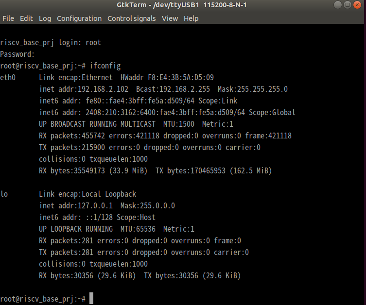
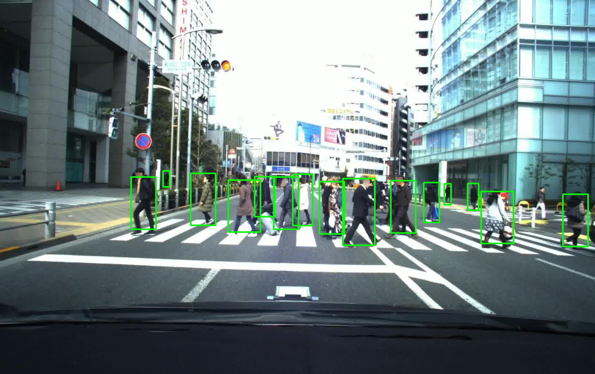

# 第5回AIエッジコンテスト 提出物実行方法

## SDカードのセットアップ
`sd.img`をSDカード(16GB以上)に書き込みます
```sh
dd
```

## Ultra96のセットアップ
SDカードをUltra96にセットし、ブートモードをSDにします。
UART-JTAGコネクタ・電源・USB-LANをUltra96に接続します。
UART-JTAGコネクタはホストPCとMicroUSBケーブルで接続し、USB-LANケーブルにLANケーブルを接続します。
※Ultra96のWiFiは対応していません。

USB-LANはr8152またはAX88179が搭載されている以下の製品での動作確認ができています。
- https://www.amazon.co.jp/gp/product/B07MK6DJ6M/
- https://www.planex.co.jp/products/usb-lan1000r/spec.shtml

Ultra96の電源ボタンを押して電源を駆動し、TeraTermやgtktermなどUSBシリアル接続が可能なアプリケーションを起動します。
BandRateは115200を設定してください。以下にgtktermでの接続画面を示します。


ブートが問題なく成功し、シリアル接続ができればユーザ名`root`パスワード`root`でログインしてください。
`ifconfig`でUSB-LAN経由で割り当てられたIPアドレスを確認します。以下の例では`192.168.2.102`が割り当てられています。


以降はホストPCからのssh接続で作業を続行できます。
```sh
ssh root@192.168.2.102 #password: root
```

## 入力用データセットの準備
Ultra96で動作するトラッキングアプリケーションは、mp4形式の動画入力に対応していないため、avi形式に変換する必要があります。ここではffmpegを使用した変換の手順を示します。

```bash
cd <parent of 'test_videos' directory>
mkdir test_videos_avi
cd test_videos_avi
for N in {0..73}; do
    S=$(printf "%02d\n" "${N}")
    ffmpeg  -i ../test_videos/test_${S}.mp4 -vcodec mjpeg test_${S}.avi
done
```
変換完了後、`test_videos_avi`ファイルをUltra96の`/home/root/`以下に配置します。
```sh
cd ..
scp -r test_videos_avi root@192.168.2.102:/home/root
```

## トラッキングアプリケーションのビルド
ビルド済みアプリケーションが`sd.img`には含まれているので、再ビルドする際にのみ必要です。
Ultra96上で作業を行います。
```sh
cd ~
cd ByteTrack-cpp-ai-edge-contest-5
#build libbytetrack.so
mkdir build && cd build
cmake -DRISCV=ON -DDPU=ON ..
make -j
cd ../app/generate_submit_file/
#build tracking application
mkdir build && cd build
cmake -DRISCV=ON -DDPU=ON
make -j
```

## トラッキングアプリケーションの実行
```sh
cd ~
cd ~/ByteTrack-cpp-ai-edge-contest-5/app/generate_submit_file/build
sh demo_run.sh #37分程度かかります
```

実行が完了すると、`build`ディレクトリ以下に`prediction_test_xx.json`が動画ファイルごとに作成されます。最後にこれらをまとめてSIGNATEの投稿用のJSONファイルを生成します。
```
cd ..
python3 combine_submit.py
```
最終的に生成された`predictions.json`が評価用のJSONファイルとなります。

## tiny-YOLOv4単体アプリケーションの実行
ここではtiny-YOLOv4単体アプリケーションの実行方法について説明します。
画像に対する推論処理、または動画に対する推論処理を実行してJSONファイルとして保存することができます。
```sh
cd demo_yolov4
sh build.sh
./demo_yolov4 ./yolov4_tiny_conf0.5.prototxt ../yolov4_tiny_signate/yolov4_tiny_signate.xmodel ./test.jpg image
```

- 出力結果
```
./demo_yolov4 ./yolov4_tiny_conf0.5.prototxt ../yolov4_tiny_signate/yolov4_tiny_signate.xmodel ./test.jpg  image
./yolov4_tiny_conf0.5.prototxt ../yolov4_tiny_signate/yolov4_tiny_signate.xmodel ./test.jpgModel Initialize Done
pedestrian 0.997999 742.968 847.408 585.005 754.543
pedestrian 0.997482 1565.91 1670.35 622.344 791.883
pedestrian 0.996782 1115.28 1219.72 580.114 797.806
pedestrian 0.995807 1271.53 1352.86 587.657 757.196
pedestrian 0.993249 1039.02 1120.36 590.477 760.015
pedestrian 0.993233 426.126 507.464 575.575 745.113
pedestrian 0.990519 1521.68 1557.93 596.448 683.082
pedestrian 0.988856 1445.64 1467.62 597.649 665.12
pedestrian 0.985038 1378.46 1429.03 593.256 723.378
pedestrian 0.976868 530.265 552.248 555.434 607.981
pedestrian 0.923061 1831.89 1913.23 631.774 801.312
pedestrian 0.851889 952.121 1017.04 566.77 733.85
pedestrian 0.8173 890.1 971.438 575.575 745.113
pedestrian 0.729961 620.609 701.947 563.076 732.614
pedestrian 0.679071 828.476 893.398 574.704 704.826
```
結果は`result.jpg`として保存されます。


## RISCV単体アプリケーションの実行
ここではRISCVにオフロードした処理のテストを行うアプリケーションの実行方法について説明します。


